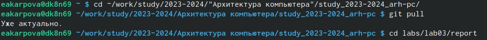
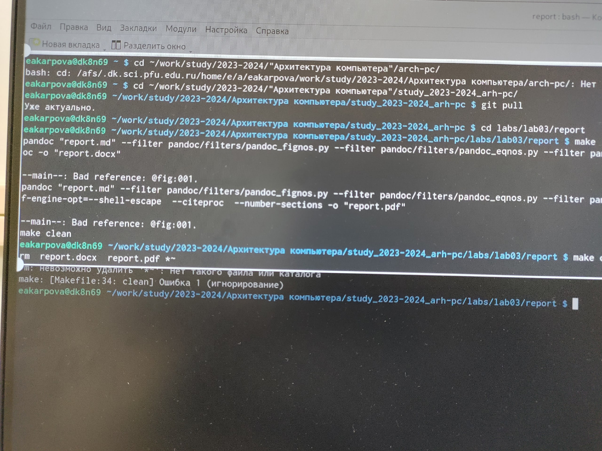

---
## Front matter
title: "Лабораторная работа №3"
subtitle: "Язык разметки Markdown"
author: "Карпова Есения Алексеевна НКАбд-02-23"

## Generic otions
lang: ru-RU
toc-title: "Содержание"

## Bibliography
bibliography: bib/cite.bib
csl: pandoc/csl/gost-r-7-0-5-2008-numeric.csl

## Pdf output format
toc: true # Table of contents
toc-depth: 2
lof: true # List of figures
lot: true # List of tables
fontsize: 12pt
linestretch: 1.5
papersize: a4
documentclass: scrreprt
## I18n polyglossia
polyglossia-lang:
  name: russian
  options:
	- spelling=modern
	- babelshorthands=true
polyglossia-otherlangs:
  name: english
## I18n babel
babel-lang: russian
babel-otherlangs: english
## Fonts
mainfont: PT Serif
romanfont: PT Serif
sansfont: PT Sans
monofont: PT Mono
mainfontoptions: Ligatures=TeX
romanfontoptions: Ligatures=TeX
sansfontoptions: Ligatures=TeX,Scale=MatchLowercase
monofontoptions: Scale=MatchLowercase,Scale=0.9
## Biblatex
biblatex: true
biblio-style: "gost-numeric"
biblatexoptions:
  - parentracker=true
  - backend=biber
  - hyperref=auto
  - language=auto
  - autolang=other*
  - citestyle=gost-numeric
## Pandoc-crossref LaTeX customization
figureTitle: "Рис."
tableTitle: "Таблица"
listingTitle: "Листинг"
lofTitle: "Список иллюстраций"
lotTitle: "Список таблиц"
lolTitle: "Листинги"
## Misc options
indent: true
header-includes:
  - \usepackage{indentfirst}
  - \usepackage{float} # keep figures where there are in the text
  - \floatplacement{figure}{H} # keep figures where there are in the text
---

# Цель работы

Целью работы является освоение процедуры оформления отчетов с помощью легковесного языка разметки Markdown

# Задание

Задания лабораторной работы:
1. Провести компиляцию шаблона
2. Заполнить отчет и скомпилировать его с использованием Makefile

# Теоретическое введение

Базовые сведения о Markdown:
Markdown - это простой и легко читаемый язык разметки, который позволяет создавать отформатированный текст, используя только текстовый формат

Основные элементы синтаксиса:
Заголовки - для создания используется знак #
Полужирное начертание - для использования нужно заключить текств  двойные звездочки
Курсивное начертание - для использования нужно заключить текст в тройные звездочки
Блок цитирования - создается с помощью символов ><
Упорядоченный список - формотируется с помощью соответсвующих цифр
Синтаксис для встроенной ссылки состоит из частеи [link text], представляющий текст гиперссылки, и части (file-name.md) - URL-адреса или имени файла, на который дается ссылка

# Выполнение лабораторной работы

1. В каталог курса, сформированном при выполнении второй лабораторной работы, обновим локальный репозиторий (см. рис. @fig:001)

{#fig:001 width=100%}

2. Проведем компиляцию шаблона с использованием Makefile с помощью команды "make" в каталоге с шаблоном отчета по лабораторной работе №3. После этого удалим полученные файлы с помощью команды "make clean" (см. рис. @fig:002)

{#fig:002 width=100%}

3. Откроем файл report.md с помощью текстового редактора gedit и заполним отчет
4. Загрузим файлы на Github 

# Выводы

С помощью данной лабораторной работы я ознакомилась с языком разметки Markdown

# Список литературы{.unnumbered}

Лабораторная работа №3. Язык разметки - Демидова А.В,

