---
## Front matter
title: "Лабораторная работа №4"
subtitle: "Создание и процесс обработки программ на языке ассемблера NASM"
author: "Карпова Есения Алексеевна"

## Generic otions
lang: ru-RU
toc-title: "Содержание"

## Bibliography
bibliography: bib/cite.bib
csl: pandoc/csl/gost-r-7-0-5-2008-numeric.csl

## Pdf output format
toc: true # Table of contents
toc-depth: 2
lof: true # List of figures
lot: true # List of tables
fontsize: 12pt
linestretch: 1.5
papersize: a4
documentclass: scrreprt
## I18n polyglossia
polyglossia-lang:
  name: russian
  options:
	- spelling=modern
	- babelshorthands=true
polyglossia-otherlangs:
  name: english
## I18n babel
babel-lang: russian
babel-otherlangs: english
## Fonts
mainfont: PT Serif
romanfont: PT Serif
sansfont: PT Sans
monofont: PT Mono
mainfontoptions: Ligatures=TeX
romanfontoptions: Ligatures=TeX
sansfontoptions: Ligatures=TeX,Scale=MatchLowercase
monofontoptions: Scale=MatchLowercase,Scale=0.9
## Biblatex
biblatex: true
biblio-style: "gost-numeric"
biblatexoptions:
  - parentracker=true
  - backend=biber
  - hyperref=auto
  - language=auto
  - autolang=other*
  - citestyle=gost-numeric
## Pandoc-crossref LaTeX customization
figureTitle: "Рис."
tableTitle: "Таблица"
listingTitle: "Листинг"
lofTitle: "Список иллюстраций"
lotTitle: "Список таблиц"
lolTitle: "Листинги"
## Misc options
indent: true
header-includes:
  - \usepackage{indentfirst}
  - \usepackage{float} # keep figures where there are in the text
  - \floatplacement{figure}{H} # keep figures where there are in the text
---

# Цель работы

Целью данной работы является освоение процедур компиляции и сборки программ, написанных на ассемблере NASM

# Задание

1. Создание программы Hello world!
2. Работа с транслятором NASM
3. Работа с расширенным синтаксисом командной строки NASM
4. Работа с компоновщиком LD
5. Запуск исполняемого файла
6. Выполнение заданий для самостоятельной работы

# Теоретическое введение

Язык ассемблера - машинно-ориентированный язык низкого уровня. NASM - это открытый проект ассемблера, версии которого доступны под различные операционные системы и который позволяет получать объектные файлы для этих систем. В NASM используется Intel-синтаксис и поддерживаются инструкции x86-64

# Выполнение лабораторной работы
1. Создание программы Hello world!

С помощью утилиты cd перемещаюсь в каталог, в котором буду работать(рис. @fig:001).

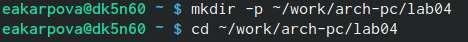{#fig:001 width=100%}

Создаю в текущем каталоге пустой файл hello.asm с помощью утилиты touch(рис. @fig:002).

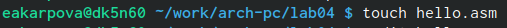{#fig:002 width=100%}

Открываю созданный файл в текстовом редакторе gedit(рис. @fig:003).

{#fig:003 width=100%}

Заполняю файл, вставляя в него программу для вывода "Hello world!"(рис. @fig:004).

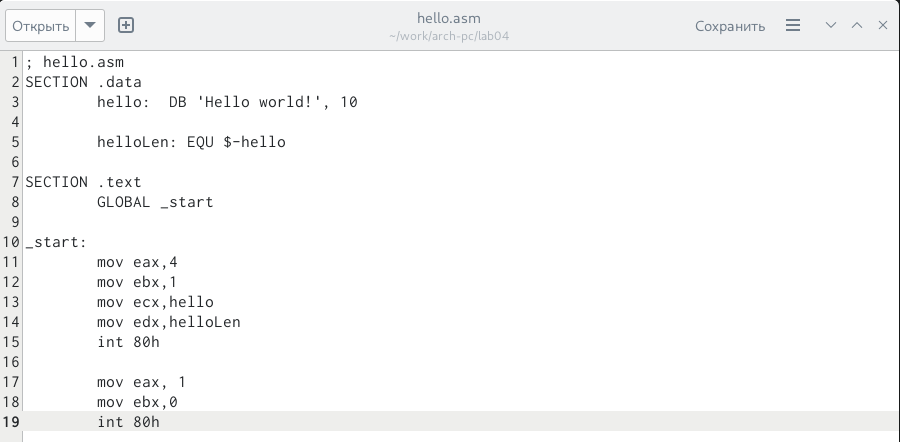{#fig:004 width=100%}

2. Работа с транслятором NASM

Превращаю текст программы для вывода "Hello world" в объектный код с помщью транслятора NASM, используя команду nasm -f elf hello.asm, ключ -f указывает траслятору nasm, что требуется создать бинарный файл в формате ELF(рис. @fig:005).

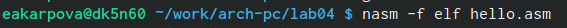{#fig:005 width=100%}

Проверяю правильность выполнения команды с помощью утилиты ls(рис. @fig:006).

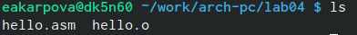{#fig:006 width=100%}

3. Работа с расширенным синтаксисом командной строки NASM

Ввожу команду, которая скомпилирует файл hello.asm в файл obj.o, при этом в файл будут включены символы для откладки (ключ -g), также с помощью ключа -l будет создан файл листинга list.lst(рис. @fig:007).

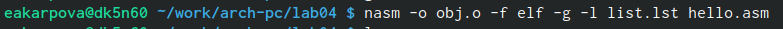{#fig:007 width=100%}

Проверяю правильность выполнения команды с помощью утилиты ls(рис. @fig:008).

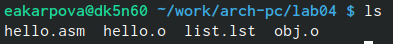{#fig:008 width=100%}

4. Работа с компоновщиком LD

Передаю объектный файл hello.o на обработку компоновщику LD, чтобы получить исполняемый файл hello. Ключ -o задает имя создаваемого исполняемого файла.(рис. @fig:009).

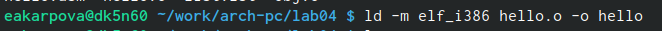{#fig:009 width=100%}

Проверяю правильность выполнения команды с помощью утилиты ls(рис. @fig:010).

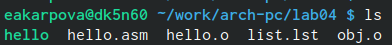{#fig:010 width=100%}

Выполняю следующую команду - исполняемый файл будет иметь имя main, т.к. после ключа -o было задано значение main. Объектный файл, из которого собран этот исполняемый файл имеет имя obj.o(рис. @fig:011).

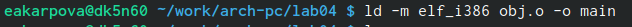{#fig:011 width=100%}

Проверяю правильность выполнения команды с помощью утилиты ls(рис. @fig:012).

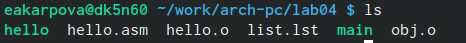{#fig:012 width=100%}

# Запуск исполняемого файла

Запускаю на выполнение созданный исполняемый файл hello(рис. @fig:013).

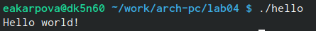{#fig:013 width=100%}

# Выполнение заданий для самостоятельной работы

1) С помощью утилиты cp создаю в текущем каталоге копию файла hello.asm с именем lab5.asm(рис. @fig:014).

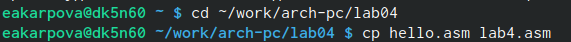{#fig:014 width=100%}

2) В текстовом редакторе gedit открываю файл lab4.asm(рис. @fig:015).
 
 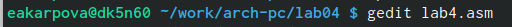{#fig:015 width=100%}
 
Вношу изменения в программу так, чтобы она выводила мое имя и фамилию(рис. @fig:015).

[Изменение программы](image/15.png){#fig:015 width=100%}

3) Компилирую текст программы в объектный файл и проверяю, что файл создан(рис. @fig:016).

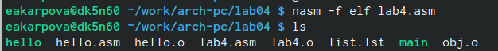{#fig:016 width=100%}

Передаю объектный файл lab4.o на обработку компоновщику LD, чтобы получить исполняемый файл lab4(рис. @fig:017).

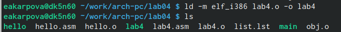{#fig:017 width=100%}

Запускаю исполняемый файл - на экран выводится мои имя и фамилия(рис. @fig:018).

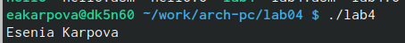{#fig:018 width=100%}

4) Копирую файлы hello.asm и lab4.asm в каталог локального репозитория(рис. @fig:019).

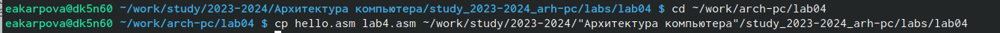{#fig:019 width=100%}

Проверяю нахождение файлов(рис. @fig:020).

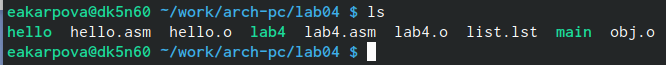{#fig:020 width=100%}

# Выводы

В ходе лабораторной работы освоила компиляции и сборки программ, написанных на языке NASM

# Список литературы{.unnumbered}

Лабораторная работа №4 Создание и процесс обработки программ на языке ассемблера NASM - Демидова А.В.
