---
## Front matter
title: "Лабораторная работа №6"
subtitle: "Арифметические операции в NASM"
author: "Карпова Есения Алексеевна"

## Generic otions
lang: ru-RU
toc-title: "Содержание"

## Bibliography
bibliography: bib/cite.bib
csl: pandoc/csl/gost-r-7-0-5-2008-numeric.csl

## Pdf output format
toc: true # Table of contents
toc-depth: 2
lof: true # List of figures
lot: true # List of tables
fontsize: 12pt
linestretch: 1.5
papersize: a4
documentclass: scrreprt
## I18n polyglossia
polyglossia-lang:
  name: russian
  options:
	- spelling=modern
	- babelshorthands=true
polyglossia-otherlangs:
  name: english
## I18n babel
babel-lang: russian
babel-otherlangs: english
## Fonts
mainfont: PT Serif
romanfont: PT Serif
sansfont: PT Sans
monofont: PT Mono
mainfontoptions: Ligatures=TeX
romanfontoptions: Ligatures=TeX
sansfontoptions: Ligatures=TeX,Scale=MatchLowercase
monofontoptions: Scale=MatchLowercase,Scale=0.9
## Biblatex
biblatex: true
biblio-style: "gost-numeric"
biblatexoptions:
  - parentracker=true
  - backend=biber
  - hyperref=auto
  - language=auto
  - autolang=other*
  - citestyle=gost-numeric
## Pandoc-crossref LaTeX customization
figureTitle: "Рис."
tableTitle: "Таблица"
listingTitle: "Листинг"
lofTitle: "Список иллюстраций"
lotTitle: "Список таблиц"
lolTitle: "Листинги"
## Misc options
indent: true
header-includes:
  - \usepackage{indentfirst}
  - \usepackage{float} # keep figures where there are in the text
  - \floatplacement{figure}{H} # keep figures where there are in the text
---

# Цель работы

Освоение арифметических инструкций языка ассемблера NASM.

# Задание

1. Символные и численные данные в NASM
2. Выполнение арифметических операций в NASM
3. Выполнение заданий для самостоятельной работы

# Теоретическое введение

Большинство инструкций на языке ассемблера требуют обработки операндов. Адрес опе-
ранда предоставляет место, где хранятся данные, подлежащие обработке. Это могут быть
данные хранящиеся в регистре или в ячейке памяти. Далее рассмотрены все существующие
способы задания адреса хранения операндов – способы адресации.
Существует три основных способа адресации:
• Регистровая адресация – операнды хранятся в регистрах и в команде используются
имена этих регистров, например: mov ax,bx.
• Непосредственная адресация – значение операнда задается непосредственно в ко-
манде, Например: mov ax,2.
• Адресация памяти – операнд задает адрес в памяти. В команде указывается символи-
ческое обозначе
Ввод информации с клавиатуры и вывод её на экран осуществляется в символьном виде.
Кодирование этой информации производится согласно кодовой таблице символов ASCII.
ASCII – сокращение от American Standard Code for Information Interchange (Американский
стандартный код для обмена информацией). Согласно стандарту ASCII каждый символ
кодируется одним байтом.
Расширенная таблица ASCII состоит из двух частей. Первая (символы с кодами 0-127)
является универсальной (см. Приложение.), а вторая (коды 128-255) предназначена для
специальных символов и букв национальных алфавитов и на компьютерах разных типов
может меняться.
Среди инструкций NASM нет такой, которая выводит числа (не в символьном виде). По-
этому, например, чтобы вывести число, надо предварительно преобразовать его цифры в
ASCII-коды этих цифр и выводить на экран эти коды, а не само число. Если же выводить число
на экран непосредственно, то экран воспримет его не как число, а как последовательность
ASCII-символов – каждый байт числа будет воспринят как один ASCII-символ – и выведет на
экран эти символы.
Аналогичная ситуация происходит и при вводе данных с клавиатуры. Введенные дан-
ные будут представлять собой символы, что сделает невозможным получение корректного
результата при выполнении над ними арифметических операций.
Для решения этой проблемы необходимо проводить преобразование ASCII символов в
числа и обратно.

# Выполнение лабораторной работы

1. Символьные и численные данные в NASM
Создаю директорию, в которой буду создавать файлы с программами для лабораторной работы №6. Перехожу в созданный каталог с помощью утилиты cd и создаю файл lab6-1.asm (рис. @fig:001).

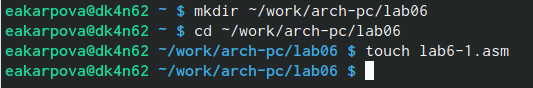{#fig:001 width=100%}

Копирую в текущий каталог файл in_out.asm с помощью утилиты cp, т.к. он будет использоваться в других программах (рис. @fig:002).

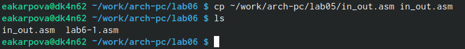{#fig:002 width=100%}

Открываю созданный файл и вставляю в него программу вывода значения регистра eax (рис. @fig:003).

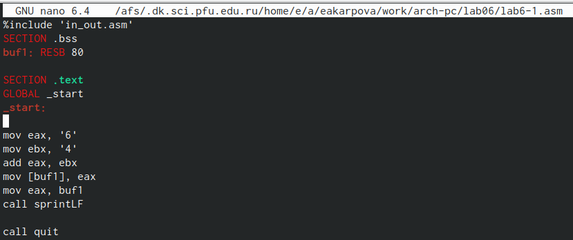{#fig:003 width=100%}

Создаю исполняемый файл программы и запускаю его (рис. @fig:004).
Программа выводит "j", так как этот символ соответствует сумме двоичных кодов символов 4 и 6 по системе ASCII

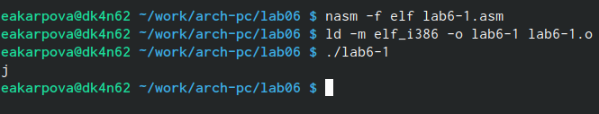{#fig:004 width=100%}

Изменяю в тексте программы символы "6" и "4" на цифры 6 и 4(рис. @fig:005).

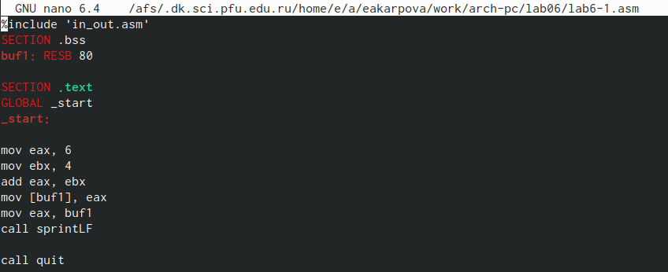{#fig:005 width=100%}

Создаю новый исполняемый файл  программы и запускаю его. Теперь вывелся символ с кодом 10, это символ перевода строки, он не отображается при выводе на экран(рис. @fig:006).

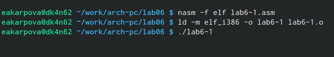{#fig:006 width=100%}

Создаю новый файл lab6-2.asm и ввожу в него текст другой программы для вывода значения регистра eax (рис. @fig:007).

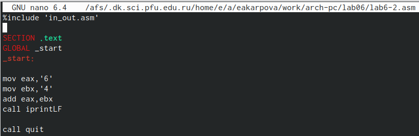{#fig:007 width=100%}

Запускаю исполняемый файл lab6-2. Теперь вывод: число 106, так как программа позволяет ввести именно число, а не символ, хотя все еще происходит сложение кодов симвоолв "6" и "4"(рис. @fig:008).

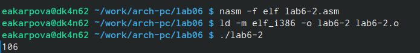{#fig:008 width=100%}

Заменяю в тексте программы символы "6" и "4" на числа 6 и 4(рис. @fig:009).

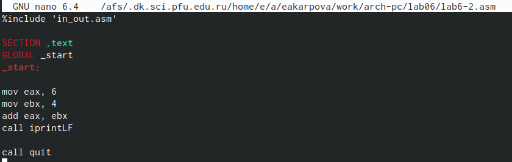{#fig:009 width=100%}

Создаю и запускаю новый исполняемый файл. теперь программа складывает не соответсвующие символам коды в системе ASIII, а сами числа, поэтому вывод 10(рис. @fig:010).

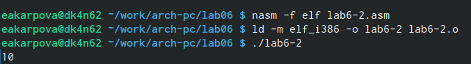{#fig:010 width=100%}

Заменяю в текст программы функцию iprintLF на iprint(рис. @fig:011).

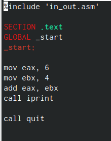{#fig:011 width=100%}

Запускаю исполняемый файл. Вывод не изменился, но iprint не добавляет к выводу символ переноса строки в отличие от iprintLF (рис. @fig:012).

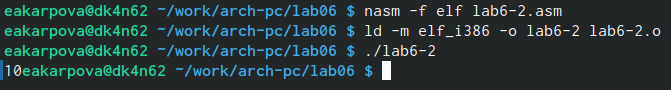{#fig:012 width=100%}

2. Выполнение арифметических операций в NASM

Создаю файл lab6-3.asm  и ввожу в него текст программы для вычисления значения выражения f(x) = (5*2+3)/3 (рис. @fig:013).

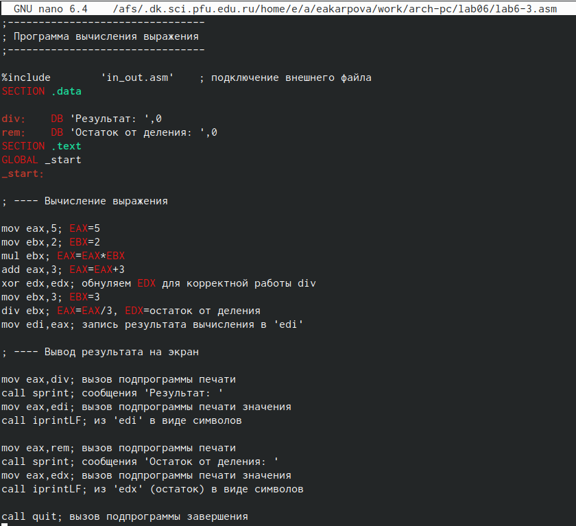{#fig:013 width=100%}

Создаю исполняемый файл и запускаю его(рис. @fig:014).

{#fig:014 width=100%}

Изменяю программу так, чтобы она вычисляла значение выражения f(x) = (4*6 + 2)/5(рис. @fig:014).

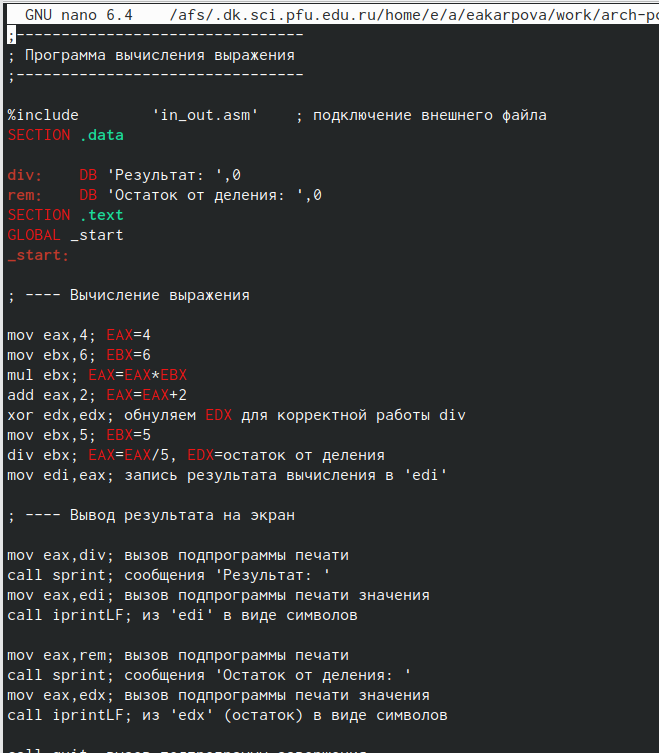{#fig:015 width=100%}

Создаю и запускаю исполняемый файл. Программа отработала верно(рис. @fig:016).

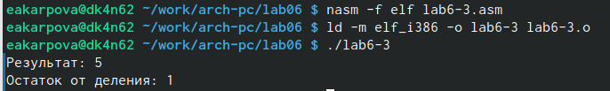{#fig:016 width=100%}

Создаю файл variant.asm и ввожу в него текст программы для вычисления задания по номеру студенческого билета(рис. @fig:017).

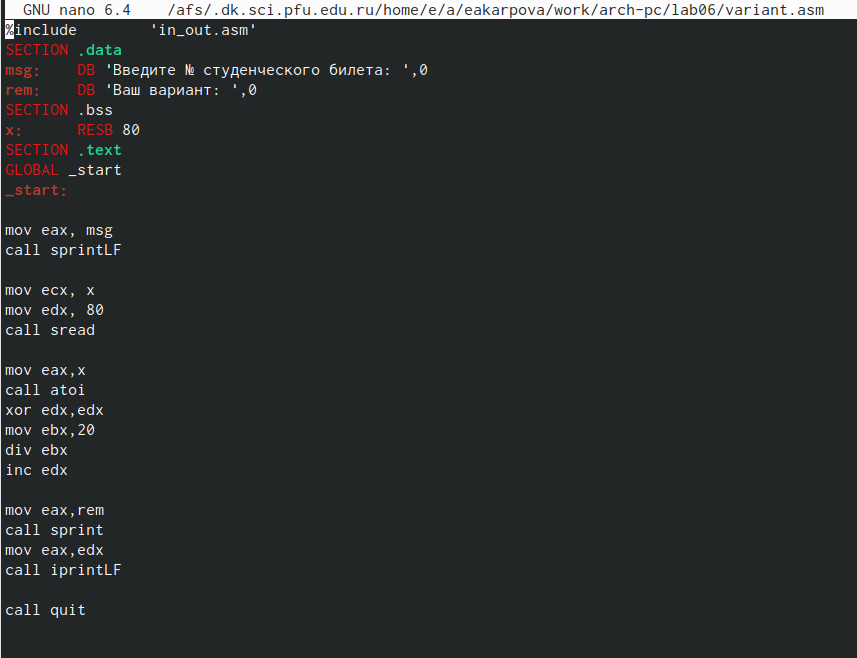{#fig:017 width=100%}

Создаю и запускаю исполняемый файл. ввожу номер своего студенческого билета, программа вывела, что мой вариант - 9(рис. @fig:018).

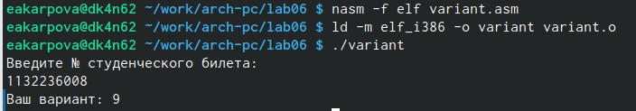{#fig:018 width=100%}

Ответы на вопросы:
1. Какие строки листинга 6.4 отвечают за вывод на экран сообщения ‘Ваш вариант:’?
Ответ:mov eax,rem
      call sprint
2. Для чего используется следующие инструкции?
1) movecx, x
2) movedx, 80
3) call sread
Ответ: 
1) Инструкция mov ecx,x используется, чтобы положить в адрес вводимой строки x в регистр ecx
2) mov edx, 80 - запись в регистр edx длины вводимой строки 
3) call sread - вызов подпрограммы из внешнегго файла, обеспечивающей ввод сообщения с клавиатуры
3. Для чего используется инструкция “call atoi”?
Ответ: call atoi используется для вызова подпрограммы тз внешнего файла, который преобразует ASCII-код символа в целое число и записывает результат в регистр eax
4. Какие строки листинга 6.4 отвечают за вычисления варианта?
Ответ: за вычисление варианта отвечают сторки:
xor edx,edx
mov ebx,20
div ebx
inc edx
5. В какой регистр записывается остаток от деления при выполнении инструкции “div
ebx”?
Ответ: при выполнении инструкции div ebx остаток от деления записывается в регистр edx
6. Для чего используется инструкция “inc edx”?
Ответ: инструкция inc edx увеличивает значение регистра edx на 1
7. Какие строки листинга 6.4 отвечают за вывод на экран результата вычислений?
Ответ: за вывод экран результатов вычисление отвечают строки 
mov eax,edx
call iprintLF
3. Выполнение заданий для самостоятельной работы

Создаю файл lab6-5.asm с помощью утилиты touch(рис. @fig:019).

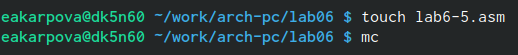{#fig:019 width=100%}

Открываю созданный файл для редактирования, ввожу текст программы для вычисления значения выражения №9: 10 + (31х - 5) (рис. @fig:020).

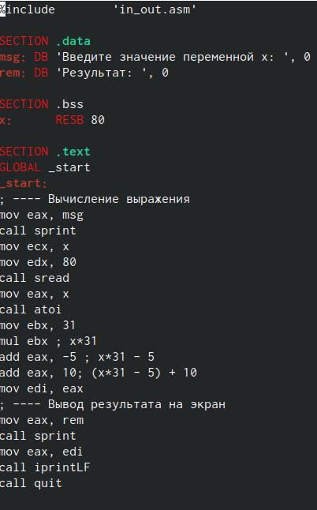{#fig:020 width=100%}

Создаю и запускаю исполняемый файл с разными значениями на взоде. Убеждаюсь, что программа работает правильно(рис. @fig:021).

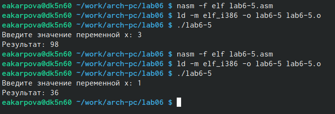{#fig:021 width=100%}

# Выводы

При выполнении данной лабораторной работы я освоила арифметические инструкции языка NASM

# Список литературы{.unnumbered}

1, Лабораторная работа№6 - Демидова А.В.
