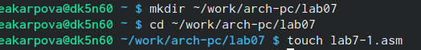

---
## Front matter
title: "Лабораторная работа ;7"
subtitle: "Команды безусловного и
условного переходов в Nasm. Программирование
ветвлений."
author: "Карпова Есения Алексеевна"

## Generic otions
lang: ru-RU
toc-title: "Содержание"

## Bibliography
bibliography: bib/cite.bib
csl: pandoc/csl/gost-r-7-0-5-2008-numeric.csl

## Pdf output format
toc: true # Table of contents
toc-depth: 2
lof: true # List of figures
lot: true # List of tables
fontsize: 12pt
linestretch: 1.5
papersize: a4
documentclass: scrreprt
## I18n polyglossia
polyglossia-lang:
  name: russian
  options:
	- spelling=modern
	- babelshorthands=true
polyglossia-otherlangs:
  name: english
## I18n babel
babel-lang: russian
babel-otherlangs: english
## Fonts
mainfont: PT Serif
romanfont: PT Serif
sansfont: PT Sans
monofont: PT Mono
mainfontoptions: Ligatures=TeX
romanfontoptions: Ligatures=TeX
sansfontoptions: Ligatures=TeX,Scale=MatchLowercase
monofontoptions: Scale=MatchLowercase,Scale=0.9
## Biblatex
biblatex: true
biblio-style: "gost-numeric"
biblatexoptions:
  - parentracker=true
  - backend=biber
  - hyperref=auto
  - language=auto
  - autolang=other*
  - citestyle=gost-numeric
## Pandoc-crossref LaTeX customization
figureTitle: "Рис."
tableTitle: "Таблица"
listingTitle: "Листинг"
lofTitle: "Список иллюстраций"
lotTitle: "Список таблиц"
lolTitle: "Листинги"
## Misc options
indent: true
header-includes:
  - \usepackage{indentfirst}
  - \usepackage{float} # keep figures where there are in the text
  - \floatplacement{figure}{H} # keep figures where there are in the text
---

# Цель работы

Изучение команд условного и безусловного переходов. Приобретение навыков написания
программ с использованием переходов. Знакомство с назначением и структурой файла
листинга.

# Задание

1. Реализация перехода в  NASM
2. Изучение структуры файлы листинга
3. Задания для самостоятельной работы

# Теоретическое введение

Для реализации ветвлений в ассемблере используются так называемые команды передачи
управления или команды перехода. Можно выделить 2 типа переходов:
• условный переход – выполнение или не выполнение перехода в определенную точку
программы в зависимости от проверки условия.
• безусловный переход – выполнение передачи управления в определенную точку про-
граммы без каких-либо условий

Безусловный переход выполняется инструкцией jmp (от англ. jump – прыжок), которая
включает в себя адрес перехода, куда следует передать управление:
jmp	<адрес_перехода>

Команда условного перехода имеет вид
j<мнемоника перехода> label

Инструкция cmp является одной из инструкций, которая позволяет сравнить операнды и
выставляет флаги в зависимости от результата сравнения.
Инструкция cmp является командой сравнения двух операндов и имеет такой же формат,
как и команда вычитания:
cmp <операнд_1>, <операнд_2>

Листинг (в рамках понятийного аппарата NASM) — это один из выходных файлов, созда-
ваемых транслятором. Он имеет текстовый вид и нужен при отладке программы, так как
кроме строк самой программы он содержит дополнительную информацию.
# Выполнение лабораторной работы

1. Реализация перехода в  NASM

1) Создаю каталог для программы лабораторной работы №7, перейдя в него создаю файл lab7-1.asm (рис. @fig:001).

{#fig:001 width=100%}

2) Ввожу в файл lab7-1.asm текст программы из листинга 7.1 и создаю исполняемый файл (рис. @fig:002).

{#fig:002 width=100%}

 На выходе получаю сообщения №2 и №3, так как с помощью инструкции jmp _label2 изменился порядок исполнения инструкций, и выполнение началось с метки _label2, пропустив вывод первого сообщения
 
3) Изменив текст программы согласно листингу 7.2 создаю исполняемый файл и проверяю его работу.(рис. @fig:003).

{#fig:003 width=100%}

Вывод изменился: теперь пользователь видит сообщения №2 и №1

4) Изменяю текст программы так, чтобы вывод программы был следующим: Сообщение №3, Сообщеие №2, Сообщеение №1
(рис. @fig:004).

{#fig:004 width=100%}

5) Проверяю - действительно, сообщения выходят в указанном порядке (рис. @fig:005).

{#fig:005 width=100%}

6) С помощью утилиты touch создаю новый исполняемый файл lab7-2.asm и ввожу в него листинг 7. - программу, которая определяет и выводит на экран наибольшую из 3 целочисленных переменныъ А, В, С. Создаю исполняемый файл и проверяю его работу на случайных значений В(рис. @fig:006).

{#fig:006 width=100%}

Убеждаюсь, что программа работает правильно

2. Изучение структуры файлы листинга

1) Создаю  файл листинга lab7-2.lst с помощью текстового редактора mcedit (рис. @fig:077).

{#fig:077 width=100%}

1.1) Объяснение трех строк на выбор:
Строка 28: 00000117 - адрес, 3B0D[39000000] - машинный код, cmp ecx,[C] - код программы - происходит сравнение А и С с помощью инстирукции cmp
Строка 29: 0000011D - адрес, 7F0C - машинный код, jg check_B - 
код программы, с помощью мнемокода jg происходит условный переход - если A > C, то выполнение программы переходит на check_B 
Строка 30: 0000011F - адрес, 8B0D[39000000] - машинный код, mov ecx,[C] - код программы - при невыполнении A > C, т.е. иначе С запишется в ecx
(рис. @fig:007).

{#fig:007 width=100%}

2) Удаляю операнд msg1 (рис. @fig:008).

{#fig:008 width=100%}

Выполняю трансляцию с получением файла листинга, но выходные файлы не созздаются, так как программа выдает ошибку (рис. @fig:009).

{#fig:009 width=100%}

В листинге в той же строке, где была намерено допущена ошибка, появляется сообщение о ней (рис. @fig:010).

{#fig:010 width=100%}

3. Задания для самостоятельной работы

1) Написала программу нахождения наименьшей из 3 целочисленных переменных a, b и c (рис. @fig:011).

{#fig:011 width=100%}

Моим вариант был №9 с числами 24, 98 и 15. Создаю исполняемый файл для проверки работы программы (рис. @fig:012).

{#fig:012 width=100%}

Программа работает корректно.
2) Написала программу, которая для введенных с клавиатуры значений x и a вычисляет
значение заданной функции f(x) и выводит результат вычислений.(рис. @fig:013.png). (рис. @fig:133).

{#fig:013 width=100%}

{#fig:133 width=100%}

Создаю исполняемый файл, чтобы убедиться в корректности работы программы (рис. @fig:014.png).

{#fig:014 width=100%}

# Выводы

Я изучила команды условного и безусловного переходов. Приобрела навыки написания
программ с использованием переходов. Познакомилась с назначением и структурой файла
листинга.

# Список литературы{.unnumbered}

Лабораторная работа №7. Команды безусловного и
условного переходов в Nasm. Программирование
ветвлений.- А.В. Демидова
