---
## Front matter
title: "Лабораторная работа №8"
subtitle: "Программирование
цикла. Обработка аргументов командной строки"
author: "Карпова Есения Алексеевна"

## Generic otions
lang: ru-RU
toc-title: "Содержание"

## Bibliography
bibliography: bib/cite.bib
csl: pandoc/csl/gost-r-7-0-5-2008-numeric.csl

## Pdf output format
toc: true # Table of contents
toc-depth: 2
lof: true # List of figures
lot: true # List of tables
fontsize: 12pt
linestretch: 1.5
papersize: a4
documentclass: scrreprt
## I18n polyglossia
polyglossia-lang:
  name: russian
  options:
	- spelling=modern
	- babelshorthands=true
polyglossia-otherlangs:
  name: english
## I18n babel
babel-lang: russian
babel-otherlangs: english
## Fonts
mainfont: PT Serif
romanfont: PT Serif
sansfont: PT Sans
monofont: PT Mono
mainfontoptions: Ligatures=TeX
romanfontoptions: Ligatures=TeX
sansfontoptions: Ligatures=TeX,Scale=MatchLowercase
monofontoptions: Scale=MatchLowercase,Scale=0.9
## Biblatex
biblatex: true
biblio-style: "gost-numeric"
biblatexoptions:
  - parentracker=true
  - backend=biber
  - hyperref=auto
  - language=auto
  - autolang=other*
  - citestyle=gost-numeric
## Pandoc-crossref LaTeX customization
figureTitle: "Рис."
tableTitle: "Таблица"
listingTitle: "Листинг"
lofTitle: "Список иллюстраций"
lotTitle: "Список таблиц"
lolTitle: "Листинги"
## Misc options
indent: true
header-includes:
  - \usepackage{indentfirst}
  - \usepackage{float} # keep figures where there are in the text
  - \floatplacement{figure}{H} # keep figures where there are in the text
---

# Цель работы

Приобретение навыков написания программ с использованием циклов и обработкой
аргументов командной строки.

# Задание

1. Реализация циклов в NASM
2. Обработка аргументов командной строки
3. Задание для самостоятельной работы

# Теоретическое введение

Стек — это структура данных, организованная по принципу LIFO («Last In — First Out»
или «последним пришёл — первым ушёл»). Стек является частью архитектуры процессора и
реализован на аппаратном уровне. Для работы со стеком в процессоре есть специальные
регистры (ss, bp, sp) и команды.
Основной функцией стека является функция сохранения адресов возврата и передачи
аргументов при вызове процедур. 
Стек имеет вершину, адрес последнего добавленного элемента, который хранится в ре-
гистре esp (указатель стека). Противоположный конец стека называется дном. Значение,
помещённое в стек последним, извлекается первым. При помещении значения в стек указа-
тель стека уменьшается, а при извлечении — увеличивается.
Для стека существует две основные операции:
 • добавление элемента в вершину стека (push);
 • извлечение элемента из вершины стека (pop).
 
Команда push размещает значение в стеке, т.е. помещает значение в ячейку памяти, на
которую указывает регистр esp, после этого значение регистра esp увеличивается на 4.
Данная команда имеет один операнд — значение, которое необходимо поместить в стек.
push -10; Поместить -10 в стек
push ebx; Поместить значение регистра ebx в стек
push [buf]; Поместить значение переменной buf в стек
push word [ax] ; Поместить в стек слово по адресу в ax

Команда pop извлекает значение из стека, т.е. извлекает значение из ячейки памяти, на
которую указывает регистр esp, после этого уменьшает значение регистра esp на 4. У этой
команды также один операнд, который может быть регистром или переменной в памяти
pop eax; Поместить значение из стека в регистр eax
pop [buf]; Поместить значение из стека в
pop word[si]; Поместить значение из стека в слово по адресу в si

Для организации циклов существуют специальные инструкции. Для всех инструкций
максимальное количество проходов задаётся в регистре ecx. Наиболее простой является ин-
струкция loop
mov ecx, 100 ; Количество проходов
NextStep:
...
...	 ; тело цикла
...
loop
NextStep ; Повторить `ecx` раз от метки NextStep

# Выполнение лабораторной работы

Создаю каталог для программам лабораторной работы № 8, перехожу в него и создаю
файл lab8-1.asm (рис. @fig:001).

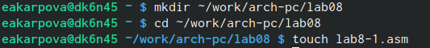{#fig:001 width=100%}

После того, как я ввела в файл текст программы из листинга, создаю исполняемый файл, чтобы проверить его работу(рис. @fig:002).

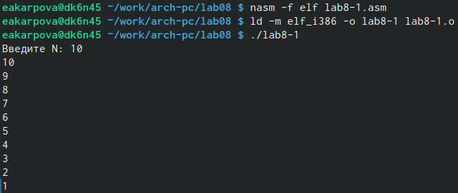{#fig:002 width=100%}

Программа вводит числа от N до 1 включительно
Данный пример показывает, что использование регистра ecx в теле цилка loop может
привести к некорректной работе программы. Изменяю текст программы добавив
значение регистра ecx в цикле и запускаю исполняемый файл, чтобы проверить его работу (рис. @fig:003).

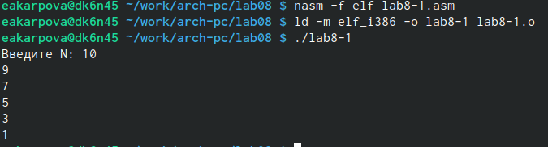{#fig:003 width=100%}

В данном случае число проходов цикла не соответсвует введенному с клавиатуры значению
Вношу изменения в текст программы, добавив команды push и pop для сохранения значения счетчиков цикла loop (рис. @fig:004).

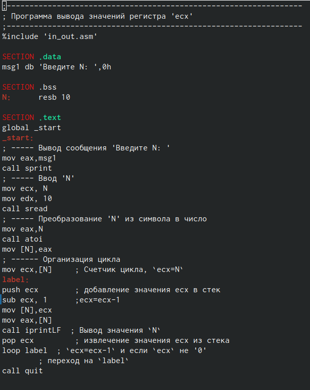{#fig:004 width=100%}

Создаю исполняемый файл и проверяю его работу (рис. @fig:005).

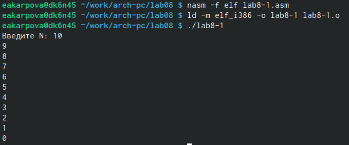{#fig:005 width=100%}

В данном случае число проходов цикла соответсвует введенному с клавиатуры значению. На выходе пользователь получает числа от N-1 до 0 включительно

2. Обработка аргументов командной строки

Создаю файл lab8-2.asm и ввожу в него текст программы из листинга 8.2.(рис. @fig:006).

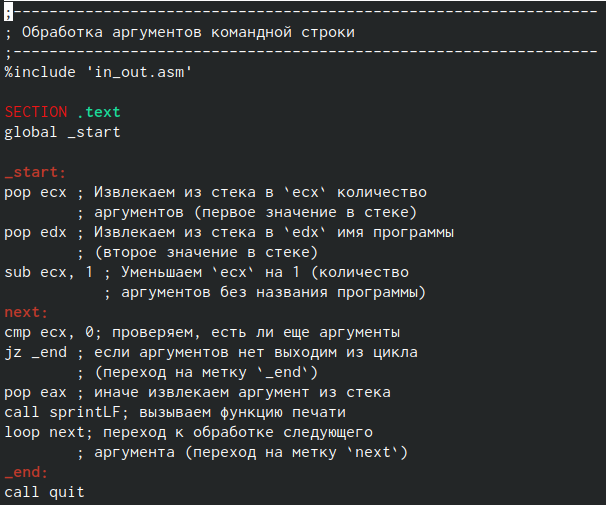{#fig:006 width=100%}

Создаю исполняемый файл и запускаю его, указав случайные аргументы (рис. @fig:007).

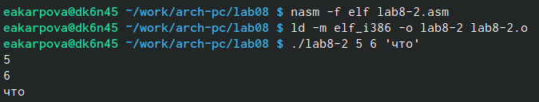{#fig:007 width=100%}

Программа вывела три введенных ей аргумента.

Рассмотрим пример программы, которая выводит сумму чисел, которые передаются в программу как аргументы. Создаю файл lab8-3.asm и ввожу в него текст программы из листинга 8.3. Создаю исполняемый файл и запускаю его, указав аргументы (рис. @fig:008).

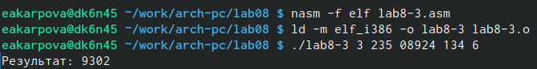{#fig:008 width=100%}

Изменяю текст программы из листинга 8.3 для вычисления произведения аргументов командной строки(рис. @fig:008).

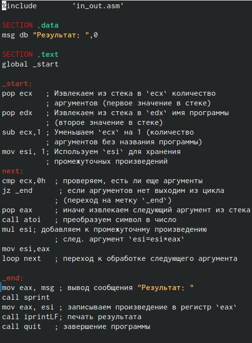{#fig:009 width=100%}

Создаю исполняемый файл и запускаю его, указав аргументы (рис. @fig:010).

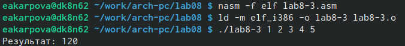{#fig:010 width=100%}

3. Задание для самостоятельной работы

Пишу текст программы, которая находит сумму значений функции f(x) = 10x - 4 в соответствии с моим девятым вариантом(рис. @fig:011).

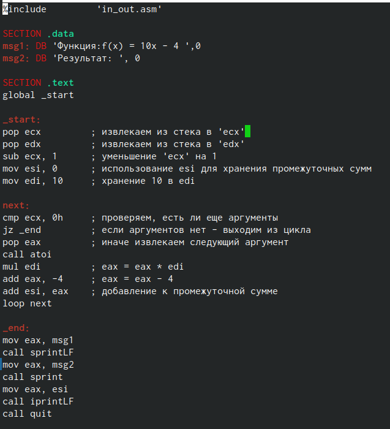{#fig:011 width=100%}

Запускаю исполняемый файл, чтобы проверить работу программы (рис. @fig:012).

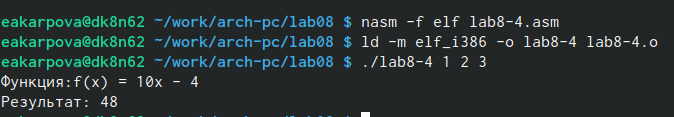{#fig:012 width=100%}

# Выводы

В ходе выполнения лабораторной работы я приобретела навыки написания программ с использованием циклов и обработкой аргументов командной строки.

# Список литературы{.unnumbered}

Лабораторная работа №8 - Демидова А.В.
