---
## Front matter
title: "Лабораторная работа №9"
subtitle: ". Понятие подпрограммы.
Отладчик GDB."
author: "Карпова Есения Алексеевна"

## Generic otions
lang: ru-RU
toc-title: "Содержание"

## Bibliography
bibliography: bib/cite.bib
csl: pandoc/csl/gost-r-7-0-5-2008-numeric.csl

## Pdf output format
toc: true # Table of contents
toc-depth: 2
lof: true # List of figures
lot: true # List of tables
fontsize: 12pt
linestretch: 1.5
papersize: a4
documentclass: scrreprt
## I18n polyglossia
polyglossia-lang:
  name: russian
  options:
	- spelling=modern
	- babelshorthands=true
polyglossia-otherlangs:
  name: english
## I18n babel
babel-lang: russian
babel-otherlangs: english
## Fonts
mainfont: PT Serif
romanfont: PT Serif
sansfont: PT Sans
monofont: PT Mono
mainfontoptions: Ligatures=TeX
romanfontoptions: Ligatures=TeX
sansfontoptions: Ligatures=TeX,Scale=MatchLowercase
monofontoptions: Scale=MatchLowercase,Scale=0.9
## Biblatex
biblatex: true
biblio-style: "gost-numeric"
biblatexoptions:
  - parentracker=true
  - backend=biber
  - hyperref=auto
  - language=auto
  - autolang=other*
  - citestyle=gost-numeric
## Pandoc-crossref LaTeX customization
figureTitle: "Рис."
tableTitle: "Таблица"
listingTitle: "Листинг"
lofTitle: "Список иллюстраций"
lotTitle: "Список таблиц"
lolTitle: "Листинги"
## Misc options
indent: true
header-includes:
  - \usepackage{indentfirst}
  - \usepackage{float} # keep figures where there are in the text
  - \floatplacement{figure}{H} # keep figures where there are in the text
---

# Цель работы

Приобретение навыков написания программ с использованием подпрограмм. Знакомство с методами отладки при помощи GDB и его основными возможностями

# Задание

1. Реализация подпрограмм в NASM
2. Отладка подпрограмм с помощью GDB
3. Добавление точек останова
4. Работа с данными подпрограммы в GDB 
5. Обработка аргументов командной строки
6. Задания для самостоятельной работы

# Теоретическое введение

Отладка — это процесс поиска и исправления ошибок в программе. В общем случае его
можно разделить на четыре этапа:
• обнаружение ошибки;
• поиск её местонахождения;
• определение причины ошибки;
• исправление ошибки.
Наиболее часто применяют следующие методы отладки:
• создание точек контроля значений на входе и выходе участка программы (например,
вывод промежуточных значений на экран — так называемые диагностические сообще-
ния);
• использование специальных программ-отладчиков.
Отладчики позволяют управлять ходом выполнения программы, контролировать и из-
менять данные. Это помогает быстрее найти место ошибки в программе и ускорить её
исправление. Наиболее популярные способы работы с отладчиком — это использование
точек останова и выполнение программы по шагам.

Пошаговое выполнение — это выполнение программы с остановкой после каждой строчки,
чтобы программист мог проверить значения переменных и выполнить другие действия.

Точки останова — это специально отмеченные места в программе, в которых программа-
отладчик приостанавливает выполнение программы и ждёт команд. Наиболее популярные
виды точек останова:
• Breakpoint — точка останова (остановка происходит, когда выполнение доходит до
определённой строки, адреса или процедуры, отмеченной программистом);
• Watchpoint — точка просмотра (выполнение программы приостанавливается, если
программа обратилась к определённой переменной: либо считала её значение, либо
изменила его)

GDB (GNU Debugger — отладчик проекта GNU) [1] работает на многих UNIX-подобных
системах и умеет производить отладку многих языков программирования. GDB предлагает
обширные средства для слежения и контроля за выполнением компьютерных программ. От-
ладчик не содержит собственного графического пользовательского интерфейса и использует
стандартный текстовый интерфейс консоли. Однако для GDB существует несколько сторон-
них графических надстроек, а кроме того, некоторые интегрированные среды разработки
используют его в качестве базовой подсистемы отладки.
Отладчик GDB (как и любой другой отладчик) позволяет увидеть, что происходит «внутри»
программы в момент её выполнения или что делает программа в момент сбоя.
GDB может выполнять следующие действия:
• начать выполнение программы, задав всё, что может повлиять на её поведение;
• остановить программу при указанных условиях;
• исследовать, что случилось, когда программа остановилась;
• изменить программу так, чтобы можно было поэкспериментировать с устранением
эффектов одной ошибки и продолжить выявление других.
Синтаксис команды для запуска отладчика имеет следующий вид:
gdb [опции] [имя_файла | ID процесса]
Команда run (сокращённо r) — запускает отлаживаемую программу в оболочке GDB.
Команда kill (сокращённо k) прекращает отладку программы

Если есть файл с исходным текстом программы, а в исполняемый файл включена информа-
ция о номерах строк исходного кода, то программу можно отлаживать, работая в отладчике
непосредственно с её исходным текстом. Чтобы программу можно было отлаживать на
уровне строк исходного кода, она должна быть откомпилирована с ключом -g.
Установить точку останова можно командой break (кратко b). Типичный аргумент этой
команды — место установки. Его можно задать как имя метки или как адрес. Чтобы не было
путаницы с номерами, перед адресом ставится «звёздочка»:
(gdb) break *<адрес>
(gdb) b <метка>
Для продолжения остановленной программы используется команда continue (c) 
(gdb) с [аргумент].

Справку о любой команде gdb можно получить, введя
(gdb) help [имя_команды]

# Выполнение лабораторной работы

1. Реализация подпрограмм в NASM

Создаю каталог для выполнения лабораторной работы № 9, перехожу в него и со-
здаю файл lab09-1.asm. Ввожу в файл текст программы с использованием  подпрограммы из листинга 9.1 и запускаю исполняемый файл, чтобы проверить его работу (рис. @fig:001).

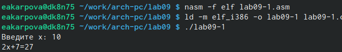{#fig:001 width=100%}

Изменяю текст программы, добавив подпрограмму _subcalcul в подпрограмму _calcul для вычисления выражения  f(g(x)), где x вводится с клавиатуры 
f(x) = 2x + 7, g(x) = 3x - 1(рис. @fig:002).

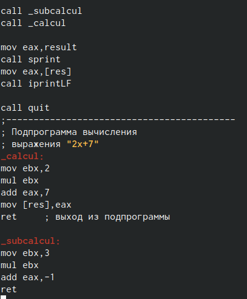{#fig:002 width=100%}

Создаю исполняемый файл и проверяю его работу (рис. @fig:003).

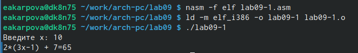{#fig:003 width=100%}

2. Отладка подпрограмм с помощью GDB

Создаю файл lab09-2.asm с текстом программы из Листинга 9.2. (рис. @fig:004).

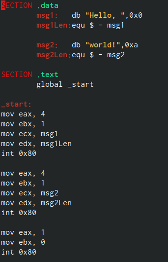{#fig:004 width=100%}

Создаю исполняемый файл и проверяю его работу (рис. @fig:005).

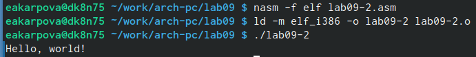{#fig:005 width=100%}

Получаю исполняемый файл для работы с GDB  с ключом '-g', загружаю исполняемый файл в отладчик gdb и проверяю работу программы, запустив ее в оболочке GDB  с помощью команды run (r) (рис. @fig:006).

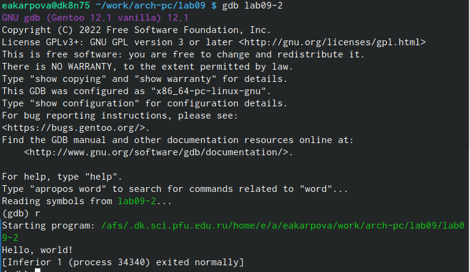{#fig:006 width=100%}

Для подробного анализа программы устанавливаю брейкпоинт на метку _start и запускаю её. Далее просматриваю дисассимилированный код программы с помощью команды disassemble начиная с метки _start  (рис. @fig:007).

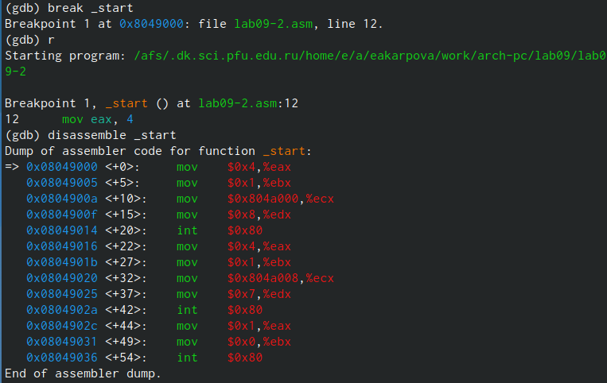{#fig:007 width=100%}

Переключаюсь на отображение команд с синтаксисом Intel, введя команду set disassembly-flavor intel (рис. @fig:008).

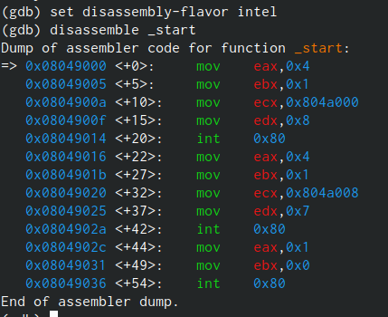{#fig:008 width=100%}

В режиме ATT имена регистров начинаются с символа %, а имена опренадов с $, в то время как в Intel используется привычный синтаксис.

Включаю режим псевдографики для более удобного анализа программы с помощью команд layout  и layout regs.(рис. @fig:009).

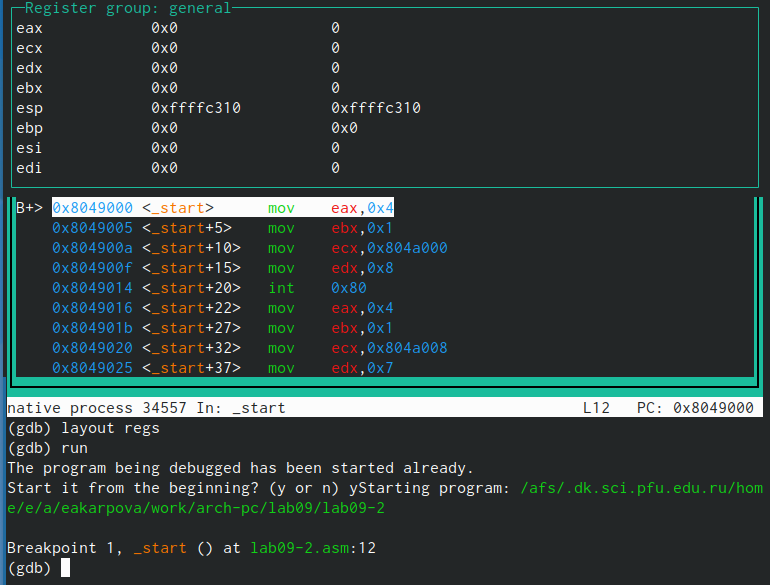{#fig:009 width=100%}

3. Добавление точек останова

Проверяю, что точка останова по имени метки _start установлена с помощью  команды info breakpoints и устанавливаю еще одну точку останова по адресу инструкции mov ebx,0x0. (рис. @fig:010).

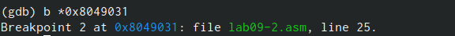{#fig:010 width=100%}

Просмотрю информацию о всех установленных точках установа(рис. @fig:011).

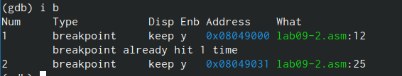{#fig:011 width=100%}

4. Работа с данными программы GDB

Выполняю 5 инструкций с помощью команды stepi и слежу за изменением значений регистров: изменились значения регистров eax, ecx, edx, ebx.

Просматриваю значение переменной msg1 по имени с помощью команды x/1sb&msg1 (рис. @fig:012).

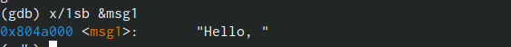{#fig:012 width=100%}

Просматриваю значение переменной msg2 по ее адресу (рис. @fig:013).

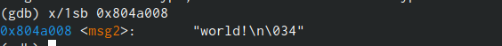{#fig:013 width=100%}

С помощью команды set изменяю первый символ переменной msg1 (рис. @fig:014).

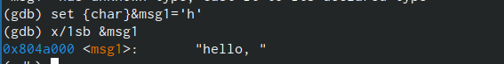{#fig:014 width=100%}

С помощью команды set изменяю первый символ переменной msg2 (рис. @fig:015).

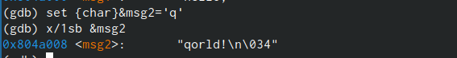{#fig:015 width=100%}

Ввожу в шестнадцатеричном, двоичном и символьном формате соответсвенно значение регистра eax с помощью команды print p/F$val (рис. @fig:016).

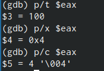{#fig:016 width=100%}

С помощью команды set изменяю значение регистра ebx в соответствии с заданием, ввожу число 2 в кавычках (рис. @fig:017).

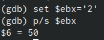{#fig:017 width=100%}

С помощью команды set изменяю значение регистра ebx в соответствии с заданием, но ввожу число 2 без кавычек (рис. @fig:018).

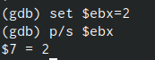{#fig:018 width=100%}

Разница вывода команд p/s $ebx отличается тем, что в первом случае мы переводим символ в его строковый вид, а во втором случае число в строковом виде не изменяется.

5. Обработка аргументов командной строки GDB

Копирую файл lab8-2.asm, созданный при выполнении лабораторной работы №8,
с программой выводящей на экран аргументы командной строки (Листинг 8.2) в файл с
именем lab09-3.asm и создаю исполняемый файл (рис. @fig:019).

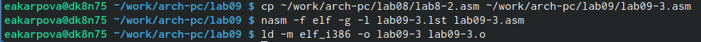{#fig:019 width=100%}

Загружаю исполняемый файл в отладчик gdb, указывая необходимые аргументы с использованием ключа -args и устанавливаю точку останова перед первой инструкцией в программе, после чего запускаю её (рис. @fig:020).

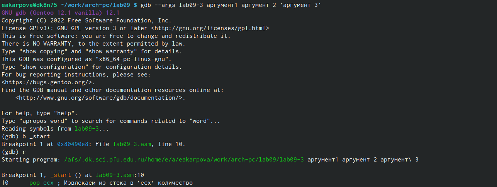{#fig:020 width=100%}

Посмотриваю вершину стека и его позиции по их адресам (рис. @fig:021).

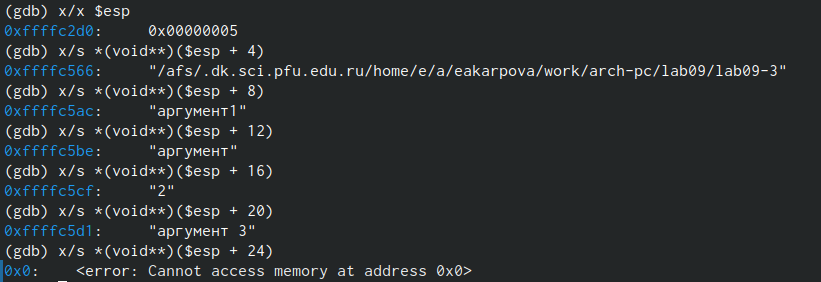{#fig:021 width=100%}

Шаг изменения адреса - 4, так как количество аргументов командной строки - 4.

6. Задания для самостоятельной работы

1) Преобразовываю программу из лабораторной работы №8 (Задание №1 для самостоятель-
ной работы), реализовав вычисление значения функции 𝑓(𝑥) как подпрограмму (рис. @fig:022).

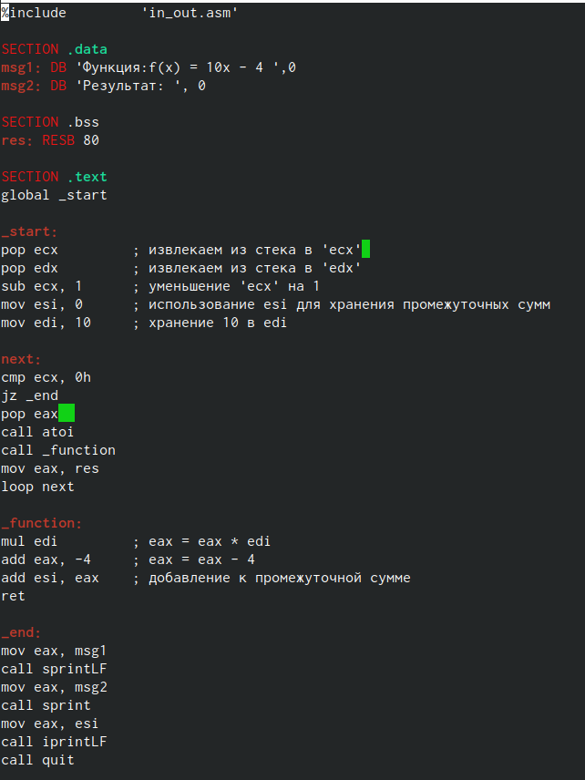{#fig:022 width=100%}

Проверяю программу, запуская исполняемый файл (рис. @fig:023).

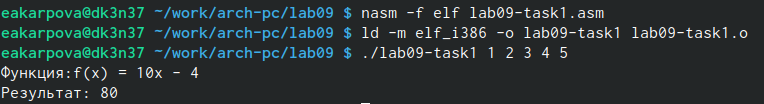{#fig:023 width=100%}

2)  Ввожу в файл текст программы из листинга 9.3 (рис. @fig:024).

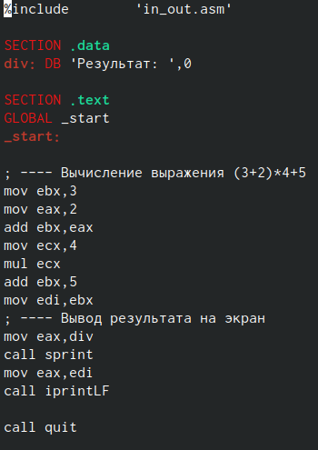{#fig:024 width=100%}

Создаю исполняемый файл и запускаю его - программа выдает число 10, значит работа программы некорректна.(рис. @fig:025).

{#fig:025 width=100%}

Получаю исполняемый файл для работы с GDB, запускаю его и ставлю брейкпоинты для каждой инструкции, связанной с вычислениями. С помощью команды continue прохожусь по каждому брейкпоинту и слежу за изменениями значений регистров. 
При выполнении инструкции mul ecx происходит умножение ecx на eax, то есть 4 на 2, вместо умножения 4 на 5, так как инструкция add ebx,eax стоящая перед mov ecx,4 не связана с mul ecx, а инструкция mov eax,2 связана (рис. @fig:026).

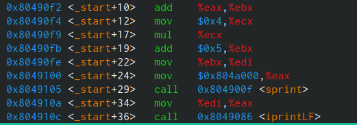{#fig:026 width=100%}

Чтобы исправить ошибку, нужно добавить после add ebx, eax - mov eax,ebx  и заменяя ebx на eax в двух инструкциях как показано на рисунке(рис. @fig:027).

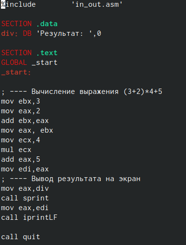{#fig:027 width=100%}

Создаю исполняемый файл и запускаю его, чтобы убедиться в правильности работы программы(рис. @fig:028).

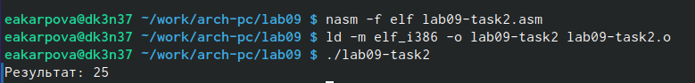{#fig:028 width=100%}

# Выводы

Во время лабораторной работы я приобрела навыки написания программ с использованием подпрограмм и ознакомилась с методами отладки при помощи GDB и его основными возможнностями

# Список литературы{.unnumbered}

Демидова А.В. - Лабораторная работа №9.Понятие подпрограммы.Отладчик GDB.
