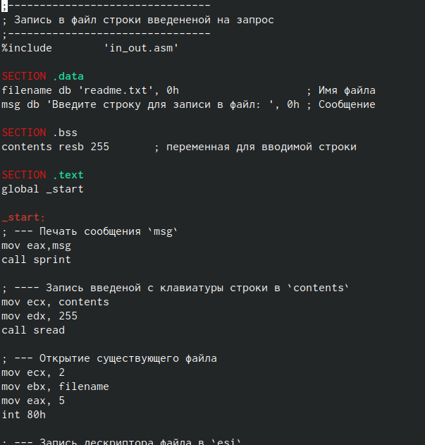
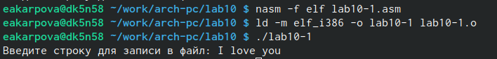
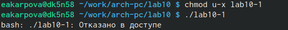
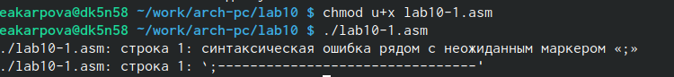
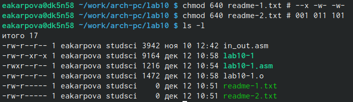
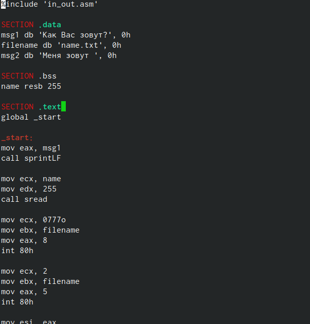

---
## Front matter
title: "Лабораторная работа №10"
subtitle: "Работа с файлами средствами Nasm"
author: "Карпова Есения Алексеевна"

## Generic otions
lang: ru-RU
toc-title: "Содержание"

## Bibliography
bibliography: bib/cite.bib
csl: pandoc/csl/gost-r-7-0-5-2008-numeric.csl

## Pdf output format
toc: true # Table of contents
toc-depth: 2
lof: true # List of figures
lot: true # List of tables
fontsize: 12pt
linestretch: 1.5
papersize: a4
documentclass: scrreprt
## I18n polyglossia
polyglossia-lang:
  name: russian
  options:
	- spelling=modern
	- babelshorthands=true
polyglossia-otherlangs:
  name: english
## I18n babel
babel-lang: russian
babel-otherlangs: english
## Fonts
mainfont: PT Serif
romanfont: PT Serif
sansfont: PT Sans
monofont: PT Mono
mainfontoptions: Ligatures=TeX
romanfontoptions: Ligatures=TeX
sansfontoptions: Ligatures=TeX,Scale=MatchLowercase
monofontoptions: Scale=MatchLowercase,Scale=0.9
## Biblatex
biblatex: true
biblio-style: "gost-numeric"
biblatexoptions:
  - parentracker=true
  - backend=biber
  - hyperref=auto
  - language=auto
  - autolang=other*
  - citestyle=gost-numeric
## Pandoc-crossref LaTeX customization
figureTitle: "Рис."
tableTitle: "Таблица"
listingTitle: "Листинг"
lofTitle: "Список иллюстраций"
lotTitle: "Список таблиц"
lolTitle: "Листинги"
## Misc options
indent: true
header-includes:
  - \usepackage{indentfirst}
  - \usepackage{float} # keep figures where there are in the text
  - \floatplacement{figure}{H} # keep figures where there are in the text
---

# Цель работы

Приобретение навыков написания программ для работы с файлами.

# Задание

1. Написание программ для работы с файлами
2. Задание для самостоятельной работы 

# Теоретическое введение

ОС GNU/Linux является многопользовательской операционной системой. И для обеспече-
ния защиты данных одного пользователя от действий других пользователей существуют
специальные механизмы разграничения доступа к файлам. Кроме ограничения доступа, дан-
ный механизм позволяет разрешить другим пользователям доступ данным для совместной
работы.
Права доступа определяют набор действий (чтение, запись, выполнение), разрешённых
для выполнения пользователям системы над файлами. Для каждого файла пользователь
может входить в одну из трех групп: владелец, член группы владельца, все остальные. Для
каждой из этих групп может быть установлен свой набор прав доступа. Владельцем файла
является его создатель. Для предоставления прав доступа другому пользователю или другой
группе командой
Обработка файлов в операционной системе Linux осуществляется за счет использования
определенных системных вызовов:
- Для создания и открытия файла служит системный вызов sys_creat, который использует
следующие аргументы: права доступа к файлу в регистре ECX, имя файла в EBX и номер
системного вызова sys_creat (8) в EAX.
- Для записи в файл служит системный вызов sys_write, который использует следующие
аргументы: количество байтов для записи в регистре EDX, строку содержимого для записи
ECX, файловый дескриптор в EBX и номер системного вызова sys_write (4) в EAX.
- Для чтения данных из файла служит системный вызов sys_read, который использует
следующие аргументы: количество байтов для чтения в регистре EDX, адрес в памяти для
записи прочитанных данных в ECX, файловый дескриптор в EBX и номер системного вызова
sys_read (3) в EAX. Как и для записи, прежде чем читать из файла, его необходимо открыть,
что позволит получить дескриптор файла.
- Для правильного закрытия файла служит системный вызов sys_close, который использует
один аргумент – дескриптор файла в регистре EBX. После вызова ядра происходит удаление
дескриптора файла, а в случае ошибки, системный вызов возвращает код ошибки в регистр
EAX.
- Для изменения содержимого файла служит системный вызов sys_lseek, который исполь-
зует следующие аргументы: исходная позиция для смещения EDX, значение смещения в
байтах в ECX, файловый дескриптор в EBX и номер системного вызова sys_lseek (19) в EAX.
- Удаление файла осуществляется системным вызовом sys_unlink, который использует
один аргумент – имя файла в регистре EBX.

# Выполнение лабораторной работы

1. Написание программ для работы с файлами
Создаю каталог для программ лабораторной работы № 10 и файлы lab10-1.asm, readme-1.txt и readme-2.txt и ввожу в файл lab10-1.asm текст программы, записанный в листинге 10.1
 (рис. @fig:001).

{#fig:001 width=100%}

Создаю исполняемый файл и проверяю его работу. Убеждаюсь, что файл работает корректно. (рис. @fig:002).

{#fig:001 width=100%}

С помощью команды chmod изменяю права доступа к исполняемому файлу lab10-1,
запретив его выполнение, и пытаюсь выполнить файл (рис. @fig:003).

{#fig:003 width=100%}

Программа пишет: "Отказано в доступе". Файл не выполнился, так как в команде указана отмена прав ("-") на исполнение ("x") владельцу ("u"). 

С помощью команды chmod изменяю права доступа к файлу lab10-1.asm с исходным
текстом программы, добавив права на исполнение (рис. @fig:001).

{#fig:004 width=100%}

Текстовый файл начинает исполнение, но не исполняется, так как не содержит в себе команд для терминала.

В соответствии со своим вариантом (9) представляю права доступа к файлу readme1.txt представленные в символьном виде, а для файла readme2.txt - в двоичном, затем проверяю правильность выполнения (рис. @fig:005).

{#fig:005 width=100%}

2. Задание для самостоятельной работы

Пишу код программы, выводящей приглашение "Как Вас зовут?", считывающей с клавиатуры фамилию и имя, и создающую файл, в который записывается сообщение "Меня зовут "(рис. @fig:006).

{#fig:006 width=100%}

Создаю исполняемый файл и проверяю его работу, после этого проверяю наличие файла и его содержимое (рис. @fig:007).

{#fig:007 width=100%}

# Выводы

В ходе выполнения лабораторной работы я приобрела навыки написания программ для работы с файлами.

# Список литературы{.unnumbered}

Демидова А.В. - Лабораторная работа №10. Работа с файлами
средствами Nasm
